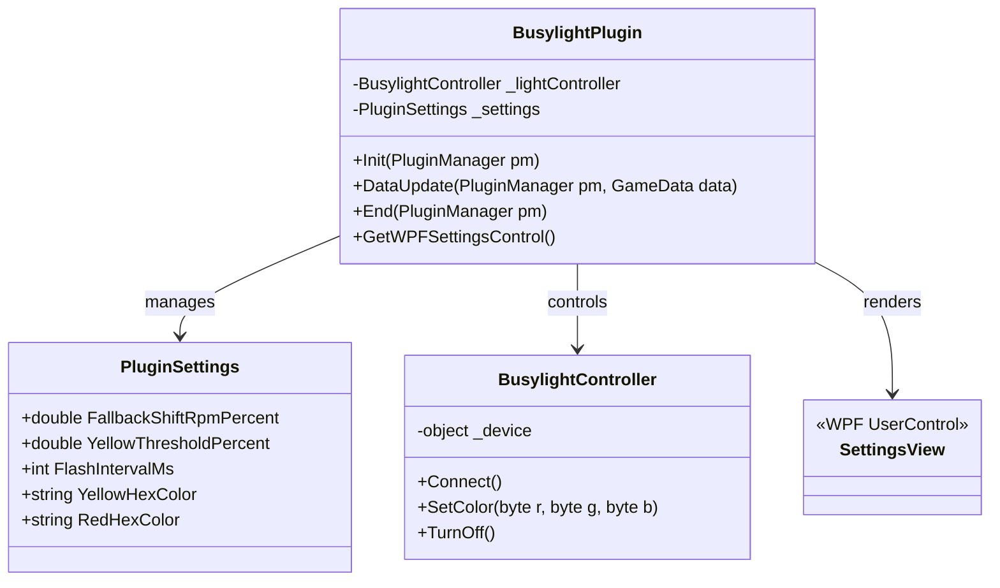

# Design Framework: Native C# SimHub Shift Light Plugin

This document outlines the architecture, code structure, dependencies, and setup steps required to migrate the Busylight Shift Light integration into a native C# SimHub plugin.

---

## 1. Objectives
* Eliminate polling overhead and network latency by running inside the SimHub process.
* Map telemetry directly from SimHub’s game loop.
* Build a clean configuration settings GUI integrated into SimHub's desktop application.
* Connect directly to the Busylight via USB/HID in C#.

---

## 2. Project Architecture & Setup

### 2.1. Project Template
The plugin should be created as a **.NET Framework 4.8 Class Library** using Visual Studio (or MSBuild). SimHub is built on .NET Framework 4.8, so target compatibility is required.

### 2.2. Dependencies & References
The project requires referencing the following files from your local SimHub installation directory (typically `C:\Program Files (x86)\SimHub`):
* `SimHub.Plugins.dll`
* `SimHub.Plugins.WPF.dll` (if adding a custom UI settings panel)
* **USB/HID Communication**: To communicate with the Busylight, you can either:
  1. Add the official **Busylight SDK DLL** (`BusylightSDK.dll`) to your references.
  2. Use a standard HID library like the **`HidSharp`** NuGet package to write raw USB reports to the device.

---

## 3. Class Structure & Design

The plugin is structured into four primary classes, translating our Python architecture into C# best practices:



### 3.1. `PluginSettings`
Stores configurable parameters. SimHub handles JSON serialization of this class automatically when loaded or saved.
```csharp
public class PluginSettings
{
    public double FallbackShiftRpmPercent { get; set; } = 0.95;
    public double YellowThresholdPercent { get; set; } = 0.85;
    public int FlashIntervalMs { get; set; } = 50;
    public string YellowHexColor { get; set; } = "#FFA500"; // Orange/Yellow
    public string RedHexColor { get; set; } = "#FF0000"; // Red
}
```

### 3.2. `BusylightController`
Wraps connection logic to the physical USB Busylight. If using the official `BusylightSDK.dll`:
```csharp
using Busylight;

public class BusylightController
{
    private SDK _sdk;

    public bool Connect()
    {
        try
        {
            _sdk = new SDK();
            return true; // Connection successful
        }
        catch
        {
            return false; // No device found
        }
    }

    public void SetColor(byte r, byte g, byte b)
    {
        // SDK uses RGB tuples to light up the LED
        _sdk?.Light(r, g, b);
    }

    public void TurnOff()
    {
        _sdk?.Light(0, 0, 0);
    }
}
```

### 3.3. `BusylightPlugin`
The main plugin class implementing `IDataPlugin` (for telemetry hooks) and `IWPFSettingsV2` (for UI integration).

```csharp
using SimHub.Plugins;
using System;
using System.Windows.Controls;

[PluginDescription("Controls a physical Busylight device as an adaptive racing shift light.")]
[PluginAuthor("StormFuel")]
[PluginName("Busylight Shift Indicator")]
public class BusylightPlugin : IDataPlugin, IWPFSettingsV2
{
    private BusylightController _lightController;
    private PluginSettings _settings;
    
    // State Tracking variables
    private string _lastState = "OFF";
    private bool _flashOn = false;
    private DateTime _lastFlashTime = DateTime.MinValue;

    /// <summary>
    /// Called when SimHub starts up.
    /// </summary>
    public void Init(PluginManager pluginManager)
    {
        // Load settings
        _settings = pluginManager.ReadCommonSettings<PluginSettings>("BusylightShiftLightSettings", () => new PluginSettings());

        // Connect to Busylight
        _lightController = new BusylightController();
        if (_lightController.Connect())
        {
            SimHub.Logging.Current.Info("Busylight connected successfully.");
        }
        else
        {
            SimHub.Logging.Current.Warn("Busylight not detected.");
        }
    }

    /// <summary>
    /// Hooked directly into SimHub's telemetry loop. Called every frame.
    /// </summary>
    public void DataUpdate(PluginManager pluginManager, ref GameData data)
    {
        if (!data.GameRunning || data.NewData == null)
        {
            SetLightState("OFF");
            return;
        }

        // 1. Pit Limiter or Neutral/Reverse Suppression
        if (data.NewData.PitLimiterOn > 0 || 
            data.NewData.Gear == "N" || 
            data.NewData.Gear == "R" || 
            data.NewData.Gear == "0")
        {
            SetLightState("OFF");
            return;
        }

        // 2. Fetch and Validate RPM thresholds
        double rpms = data.NewData.Rpms;
        double maxRpm = data.NewData.CarSettings_MaxRPM;
        double shiftRpm = data.NewData.CarSettings_ShiftLightRPM;

        // Fallback Shift RPM
        if (shiftRpm <= 0)
        {
            if (maxRpm > 0)
            {
                shiftRpm = maxRpm * _settings.FallbackShiftRpmPercent;
            }
            else
            {
                SetLightState("OFF");
                return;
            }
        }

        double yellowThreshold = shiftRpm * _settings.YellowThresholdPercent;

        // 3. Determine and Apply State
        if (rpms >= shiftRpm)
        {
            SetLightState("FLASH_RED");
        }
        else if (rpms >= yellowThreshold)
        {
            SetLightState("YELLOW");
        }
        else
        {
            SetLightState("OFF");
        }
    }

    private void SetLightState(string targetState)
    {
        if (targetState == "OFF")
        {
            if (_lastState != "OFF")
            {
                _lightController.TurnOff();
                _lastState = "OFF";
            }
        }
        else if (targetState == "YELLOW")
        {
            if (_lastState != "YELLOW")
            {
                var color = ConvertHexToRGB(_settings.YellowHexColor);
                _lightController.SetColor(color.R, color.G, color.B);
                _lastState = "YELLOW";
            }
        }
        else if (targetState == "FLASH_RED")
        {
            var now = DateTime.UtcNow;
            var elapsedMs = (now - _lastFlashTime).TotalMilliseconds;
            
            if (_lastState != "FLASH_RED" || elapsedMs >= _settings.FlashIntervalMs)
            {
                _flashOn = (_lastState == "FLASH_RED") ? !_flashOn : true;
                _lastFlashTime = now;
                _lastState = "FLASH_RED";

                if (_flashOn)
                {
                    var color = ConvertHexToRGB(_settings.RedHexColor);
                    _lightController.SetColor(color.R, color.G, color.B);
                }
                else
                {
                    _lightController.TurnOff();
                }
            }
        }
    }

    /// <summary>
    /// Called when SimHub closes.
    /// </summary>
    public void End(PluginManager pluginManager)
    {
        _lightController?.TurnOff();
        pluginManager.SaveCommonSettings("BusylightShiftLightSettings", _settings);
    }

    /// <summary>
    /// Returns the WPF user control settings panel rendered inside SimHub's dashboard menu.
    /// </summary>
    public Control GetWPFSettingsControl(PluginManager pluginManager)
    {
        return new SettingsView(this, _settings);
    }

    private (byte R, byte G, byte B) ConvertHexToRGB(string hex)
    {
        try
        {
            hex = hex.Replace("#", "");
            byte r = Convert.ToByte(hex.Substring(0, 2), 16);
            byte g = Convert.ToByte(hex.Substring(2, 2), 16);
            byte b = Convert.ToByte(hex.Substring(4, 2), 16);
            return (r, g, b);
        }
        catch
        {
            return (255, 255, 255); // Fallback to white if hex is invalid
        }
    }
}
```

---

## 4. Setting up Settings GUI Panel (WPF)
To allow setting customization inside SimHub, implement `SettingsView.xaml` (a WPF UserControl).
1. Add numeric input boxes for:
   * Fallback RPM percentage (`0.95`).
   * Yellow trigger percentage (`0.85`).
   * Flash duration in milliseconds (`50`).
2. Add color pickers for Yellow and Red hex values.
3. Bind these inputs to the `PluginSettings` object instance. SimHub automatically handles saving configurations whenever the values are changed or SimHub exits.

---

## 5. Deployment and Installation

1. **Build Project**: Compile the C# Class Library in `Release` configuration.
2. **Move DLLs**: Copy the output assembly DLL (`BusylightShiftLight.dll`) and its dependencies (like the `BusylightSDK.dll` or `HidSharp.dll`) into SimHub's root folder:
   `C:\Program Files (x86)\SimHub`
3. **Activate Plugin**:
   * Open SimHub.
   * Go to the **Plugins** or **Settings** tab.
   * Find "Busylight Shift Indicator" in the list and switch the toggle to **Enabled**.
   * SimHub will ask to restart. After restarting, a custom settings panel will be visible in the left sidebar under the plugin's name.
